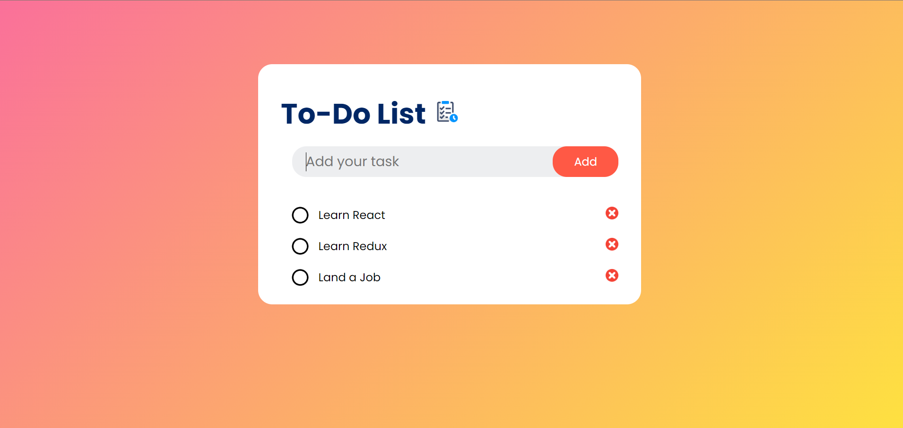

# To-do List Application

This is a simple To-do List application built using HTML, CSS, and JavaScript. It allows users to add, remove, and mark tasks as completed.

Site is live at https://reninmohan.github.io/To-Do-List-Application/

## Screenshots

## Features

- Add tasks: Users can input tasks and press Enter or click the "Add" button to add them to the list.
- Remove tasks: Users can remove tasks by clicking the ❌ icon next to each task.
- Mark tasks as completed: Users can mark tasks as completed by clicking on them. Completed tasks will have a line-through style.
- Local storage: The application stores task data in the browser's local storage, so tasks are saved even after refreshing the page.
- Responsive design: The application is designed to be responsive and work well on different screen sizes.

## Getting Started

To run the application locally, follow these steps:

1. Clone this repository to your local machine.
2. Open the `index.html` file in a web browser.
3. Start adding tasks and managing your to-do list!

## Technologies Used

- HTML
- CSS
- JavaScript

## Credits

This application was created by Renin Mohanan.

